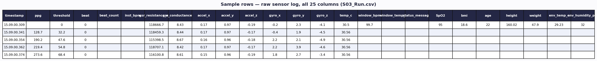
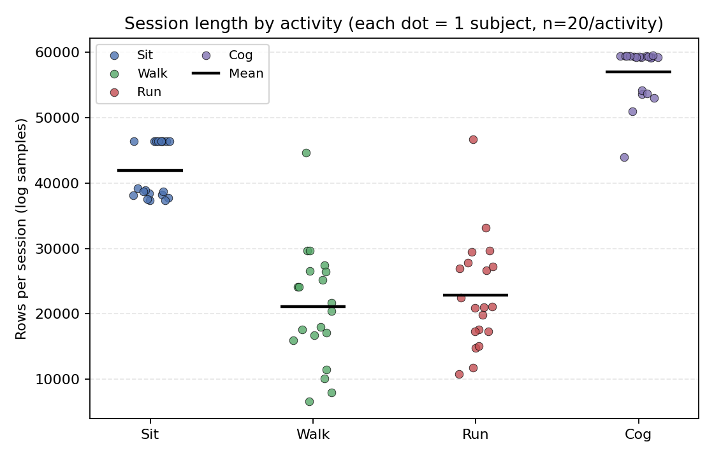
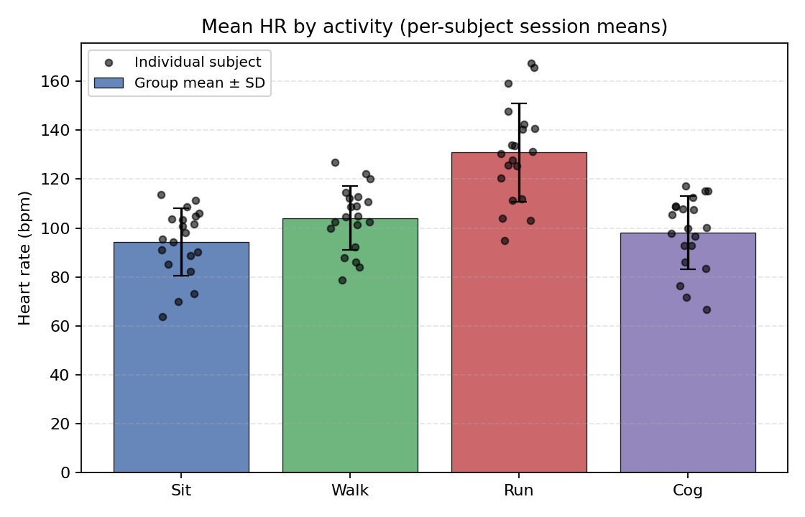
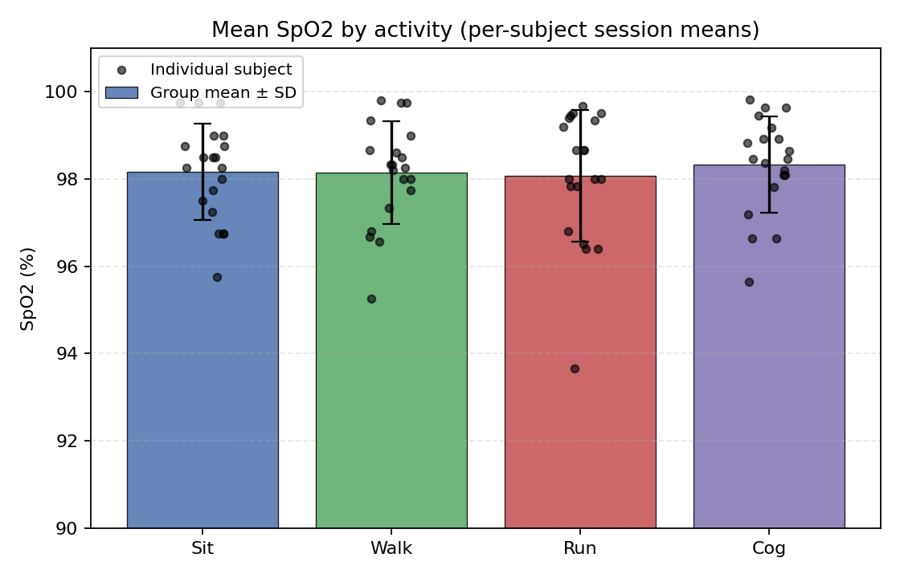
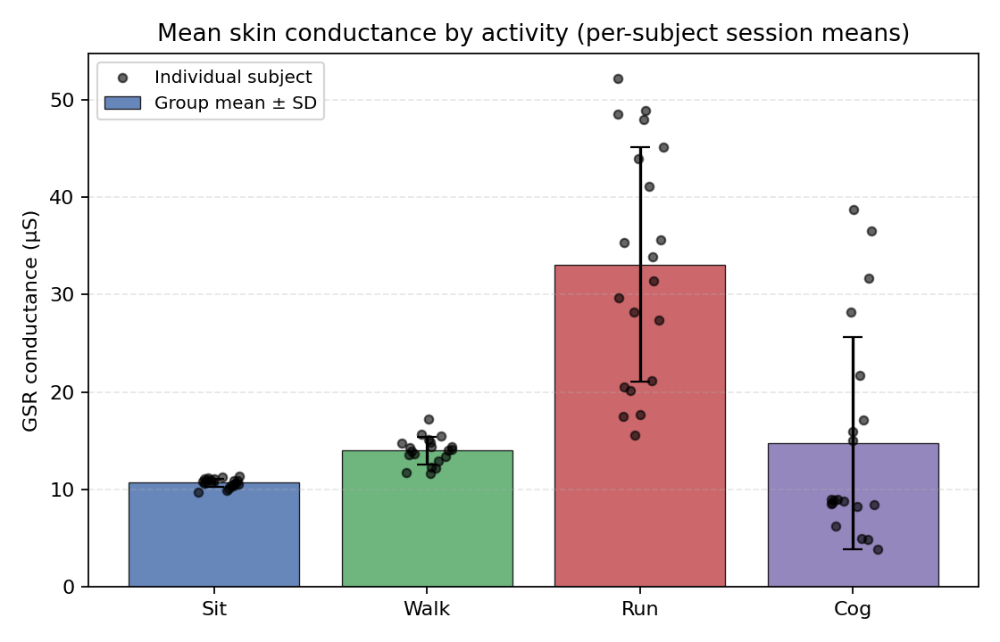
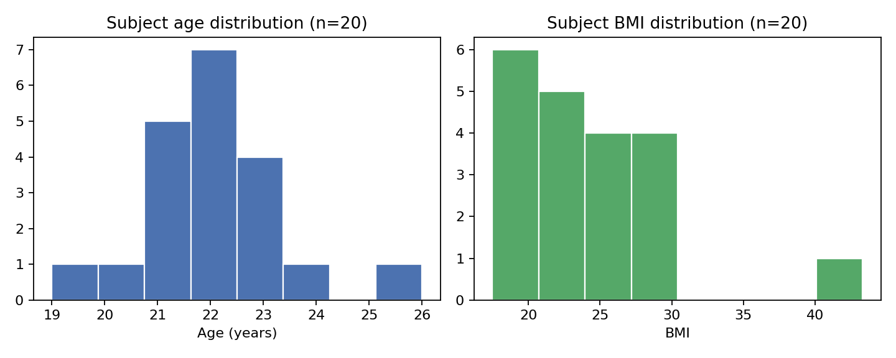

# Multimodal Wearable Physiology Dataset

A dataset of continuous wearable-sensor recordings (PPG, GSR, accelerometer, gyroscope, skin temperature) paired with manual pulse-oximeter SpO2 checkpoints, collected from 20 subjects across 4 activities: **Sit, Walk, Run, Cog**.

---

## 1. What's in the zip

```
EVERYTHING_DATA_renamed.zip
├── modified_csvs/
│   ├── S01_Sit.csv, S01_Walk.csv, S01_Run.csv, S01_Cog.csv
│   ├── S02_Sit.csv, ...
│   └── ... (S01–S20 × 4 activities = 80 files)
└── subject_metadata.csv
```

| Item | Value |
|---|---|
| Subjects | 20 (S01–S20) |
| Activities per subject | 4 (Sit, Walk, Run, Cog) |
| Total CSV files | 80 |
| Total rows, all files | 2,856,926 |
| Columns per file | 25 |
| Total size | ~245 MB |
| Sample rate | ~100–150 Hz on the continuous channels (per-millisecond timestamps) |

---

## 2. Snapshot of the raw data

Below are actual rows pulled straight from `S03_Run.csv` (unmodified), showing all 25 columns as logged.



**What each column means:**

| Column | Meaning |
|---|---|
| `timestamp` | Device clock, `HH.MM.SS.mmm`, one row per sensor tick |
| `ppg` | Raw photoplethysmography signal (AC-coupled, so negative values are normal) |
| `threshold` | Adaptive threshold used by the onboard beat detector |
| `beat` | 1 when a heartbeat is detected on that row, else 0 |
| `beat_count` | Running count of detected beats |
| `inst_bpm` | Instantaneous heart rate, computed only on beat-detection rows |
| `gsr_resistance_ohm` / `gsr_conductance_us` | Galvanic skin resistance / conductance (arousal proxy) |
| `accel_x/y/z`, `gyro_x/y/z` | 6-axis IMU (motion/orientation) |
| `temp_c` | Skin temperature at the sensor |
| `window_bpm` / `window_temp_c` | HR / temperature averaged over a rolling window, logged periodically |
| `status_message` | Reserved for device status text — empty in every row of this dataset |
| `SpO2` | **Manually entered** oxygen saturation from an analog pulse oximeter, only filled in at protocol checkpoints |
| `bmi`, `age`, `height`, `weight` | Subject metadata, stamped once on the first row of each file |
| `env_temp_c`, `env_humidity_pct` | Room temperature/humidity, stamped once on the first row of each file |

**Two different "row types" live in the same file:** high-frequency sensor rows (ppg/gsr/imu, logged nearly every tick) and low-frequency checkpoint rows (SpO2, metadata — logged once or a handful of times per file). This is why the missingness numbers in Section 6 look extreme for some columns — it's by design, not data loss.

---

## 3. Data collection procedure

All subjects wore the sensor rig continuously through logging. A hand-held analog pulse oximeter was used to take manual SpO2 spot-checks at fixed points in the protocol (the oximeter is not networked to the logger, so its readings are hand-entered into the `SpO2` column at the matching timestamp).

**Sit (resting baseline)**
1. Start logging.
2. Subject sits still for 5 minutes (settling period, no SpO2 reads).
3. Manual SpO2 taken every 5 minutes for the next 10 minutes (2 readings).
4. Two more SpO2 readings taken 1 minute apart.
→ 4 manual SpO2 checkpoints per subject, fixed by design.

**Walk / Run (exertion + recovery)**
1. Start logging.
2. Subject stays stable for 5 minutes.
3. SpO2 taken immediately before exertion begins.
4. Subject performs the walk/run.
5. SpO2 taken immediately on return.
6. SpO2 taken every 1 minute afterward until heart rate returns to baseline / stabilizes.
→ Checkpoint count varies per subject (2–9), since the endpoint is gated by individual heart-rate recovery time rather than a fixed clock.

**Cog (cognitive/emotional load)**
1. Subject completes an EQ (emotional-intelligence) questionnaire.
2. Start logging.
3. Subject sits still for 5 minutes (settling period).
4. Manual SpO2 taken every 1 minute for the next 10 minutes.
→ ~10–12 manual SpO2 checkpoints per subject.

---

## 4. Session length by activity



| Activity | Rows (min–max) | Rows (mean) |
|---|---:|---:|
| Sit | 37,343 – 46,433 | 41,886 |
| Walk | 6,622 – 44,691 | 21,077 |
| Run | 10,816 – 46,680 | 22,878 |
| Cog | 43,947 – 59,533 | 57,005 |

Wall-clock duration across all 80 sessions ranges **114 s – 782 s** (mean ≈ 395 s / ~6.6 min). Walk and Run vary the most because their end point is HR-recovery-gated, not fixed.

---

## 5. Physiological signals by activity

**Heart rate** (from `inst_bpm`, the beat-by-beat PPG-derived HR):



| Activity | Mean HR (bpm) | SD |
|---|---:|---:|
| Sit | 96.1 | 13.3 |
| Cog | 100.4 | 15.2 |
| Walk | 105.7 | 13.4 |
| Run | 134.1 | 24.0 |

HR ranks in the expected direction: Sit ≈ Cog < Walk < Run.

**Manual SpO2 checkpoints:**



| Activity | Mean SpO2 (%) | SD | Range |
|---|---:|---:|---|
| Sit | 98.16 | 1.26 | 94–100 |
| Walk | 98.09 | 1.31 | 95–100 |
| Run | 98.16 | 1.52 | 93–100 |
| Cog | 98.33 | 1.32 | 95–100 |

SpO2 stays tight around 98% on average across all activities — no systematic desaturation — though individual Run readings dipped as low as 93%.

**Skin conductance (GSR)** — a proxy for sympathetic arousal:



| Activity | Mean µS | SD |
|---|---:|---:|
| Sit | 10.66 | 0.45 |
| Cog | 14.96 | 10.78 |
| Walk | 14.01 | 1.41 |
| Run | 34.17 | 14.52 |

GSR roughly triples during Run vs. Sit, consistent with physical exertion driving sympathetic activation. Cog shows the widest spread (SD 10.78), suggesting high inter-subject variability in emotional/cognitive arousal response.

---

## 6. Subject demographics (n=20)



| Field | Min | Max | Mean | SD |
|---|---:|---:|---:|---:|
| Age (years) | 19 | 26 | 22.0 | 1.5 |
| BMI | 17.5 | 43.3 | 24.2 | 5.9 |
| Height (cm) | 144.8 | 175.3 | 161.4 | 8.1 |
| Weight (kg) | 40.7 | 114.3 | 63.2 | 16.7 |

Ambient conditions differed slightly by activity block: Sit/Cog were recorded at ~30.9 °C / 41.8% humidity, Walk/Run at ~32.7 °C / 49.4% humidity (different session/day for exertion tasks).

> The original metadata included a `condition` column (healthy / mild risk / moderate risk / blank). This field is **not validated** and has been dropped from this dataset summary — do not use it for analysis.

---

## 7. Data quality

- 80/80 expected files present, no duplicates.
- High-frequency channels (`ppg`, `gsr_*`, `accel_*`, `gyro_*`, `temp_c`): <0.3% missing — clean.
- `inst_bpm` / `window_bpm`: ~98–99% "missing" **by design** — only populated on beat-detection / window-close rows, not a data-quality issue.
- `SpO2`, `bmi`, `age`, `height`, `weight`, `env_temp_c`, `env_humidity_pct`: ~100% missing overall **by design** — checkpoint/header-only fields, not per-row measurements.
- `status_message`: empty in every row — safe to drop entirely.
- `condition` (in `subject_metadata.csv`): unreliable, excluded from this report.
- No formal outlier removal has been applied. `ppg` legitimately spans negative-to-positive values (AC-coupled raw signal) — expected, not corrupted data.

---

## 8. Key findings

- 20 subjects × 4 activities, ~2.86M sensor rows, 245 MB raw.
- Heart rate increases with exertion as expected: Sit (96) ≈ Cog (100) < Walk (106) < Run (134 bpm).
- SpO2 remains stable (~98% mean) across all activities; isolated dips to 93% seen only during Run.
- Skin conductance more than triples from Sit to Run (10.7 → 34.2 µS), tracking physical exertion.
- Manual SpO2 sampling density is protocol-defined: fixed 4 points for Sit, ~11 for Cog, variable (HR-recovery-gated) for Walk/Run.
- Two structurally different row types exist per file (high-frequency sensor stream vs. low-frequency checkpoint rows) — account for this before computing missing-data stats or running per-row models.
